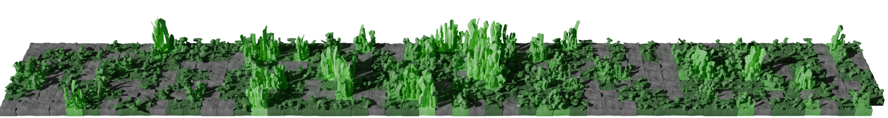
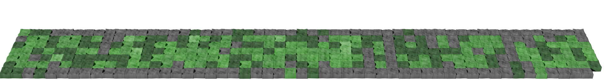
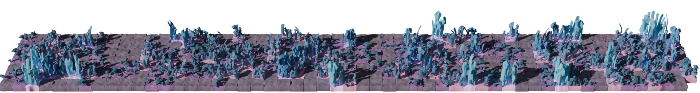
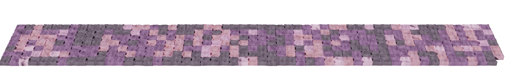

[English](README.md) | [日本語](README.ja.md)

_気に入ってくれたら, スターがほしいです ⭐️_

## Getting Started

### GitHub Actions
あなたの Profile リポジトリの `.github/workflows/cgrass.yml` に以下のコードをコピーしてください。

```yaml
name: Generate Picture and Push to output branch

on:
    push:
        branches:
            - main
    schedule:
        - cron: '0 0 * * *' # any time you want
    
permissions:
    contents: write

jobs:
    generate:
        runs-on: ubuntu-24.04

        steps:
          - name: Checkout
            uses: actions/checkout@v4

          - name: Generate Picture
            uses: nrysk/cgrass@v1.0.0
            with:
                github_username: ${{ github.repository_owner }}
                github_token: ${{ secrets.GITHUB_TOKEN }}
                output_path: output/output.png
                command: "theme"
                argument: "github"

          - name: Push output image to output branch
            uses: crazy-max/ghaction-github-pages@v4
            with:
                target_branch: output
                build_dir: output
                commit_message: "Generate Output Image"
            env:
                GITHUB_TOKEN: ${{ secrets.GITHUB_TOKEN }}
```

以下のコードで生成された画像を表示できます。
```

```

## Themes
### ☘️ github theme



```yaml
command: "theme"
argument: "github" # change here
```

### ☘️ github-nograss theme


```yaml
command: "theme"
argument: "github-nograss" # change here
```

### 🪐 planet theme


```yaml
command: "theme"
argument: "planet" # change here
```

### 🪐 planet-nograss theme


```yaml
command: "theme"
argument: "planet-nograss" # change here
```

## Make your own theme

### 1. 設定ファイルを作成します
Profile リポジトリに設定ファイルを作成します. 例えば, `mytheme.toml` というファイルをリポジトリのルートに作成します.

コンフィグファイル例: [mytheme.toml](mytheme.toml)

### 2. 設定ファイルをリンクします
`.github/workflows/cgrass.yml` の `command` と `argument` を変更します.

```yaml
  - name: Generate Picture
    uses: nrysk/cgrass@v1.0.0
    with:
        github_username: ${{ github.repository_owner }}
        github_token: ${{ secrets.GITHUB_TOKEN }}
        output_path: output/output.png
        command: "themefile" # change here
        argument: ${{ github.workspace }}/mytheme.toml # change here
```

### 3. 後は好きなように設定ファイルを変更してください

### 4. 面白いテーマができるのを楽しみにしています！

---

_アイデアがあれば, 共有していただけると幸いです_
